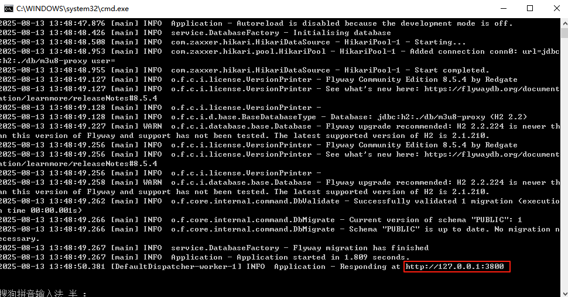
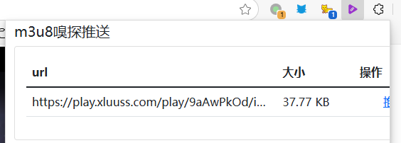
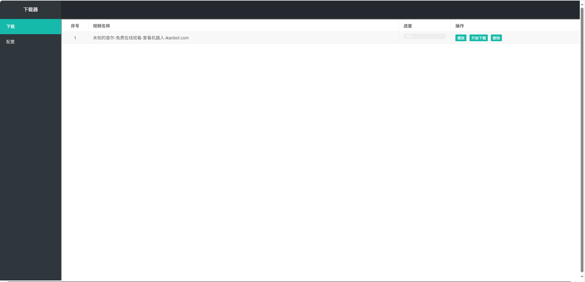
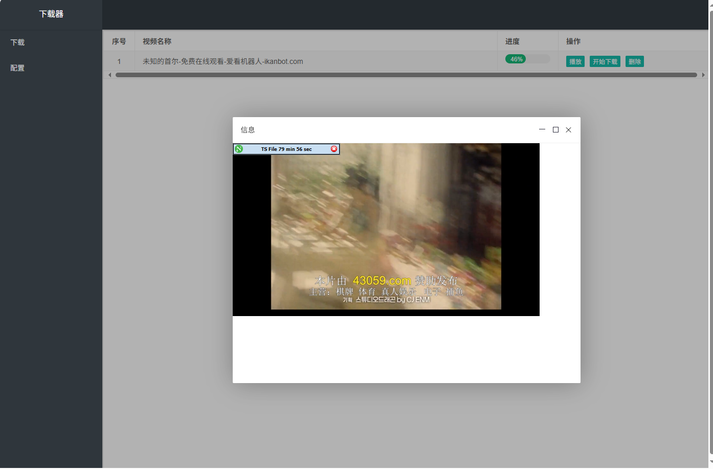

# m3u8-proxy-kt


实现视频边下边播，支持m3u8和mp4（其他照道理支持content-range的都支持）

# 实现原理
Mp4：利用在线播放支持Content-range,代理服务器多协程下载，每个协程下载1M，不断往后下载，顺序返回实现流畅播放（比如某些限速网盘）
m3u8:下载M3u8文件，构建本地M3u8文件，返回给播放器，使播放器走代理服务器获取本地下载的TS文件片段。后台下载协程按照顺序多协程下载文件（适合某些总卡顿的网站）

# 用法
下载压缩包解压，点击bin文件夹启动脚本启动，出现本地地址直接浏览器访问
配合`https://github.com/lushunming/m3u8-dl-sniffer` 浏览器插件，可以直接获取视频地址，一键发送到本服务中


# 截图






## Features

Here's a list of features included in this project:

| Name                                                               | Description                                                                        |
| --------------------------------------------------------------------|------------------------------------------------------------------------------------ |
| [CORS](https://start.ktor.io/p/cors)                               | Enables Cross-Origin Resource Sharing (CORS)                                       |
| [Routing](https://start.ktor.io/p/routing)                         | Provides a structured routing DSL                                                  |
| [Swagger](https://start.ktor.io/p/swagger)                         | Serves Swagger UI for your project                                                 |
| [Call Logging](https://start.ktor.io/p/call-logging)               | Logs client requests                                                               |
| [Content Negotiation](https://start.ktor.io/p/content-negotiation) | Provides automatic content conversion according to Content-Type and Accept headers |
| [GSON](https://start.ktor.io/p/ktor-gson)                          | Handles JSON serialization using GSON library                                      |

## Building & Running

To build or run the project, use one of the following tasks:

| Task                          | Description                                                          |
| -------------------------------|---------------------------------------------------------------------- |
| `./gradlew test`              | Run the tests                                                        |
| `./gradlew build`             | Build everything                                                     |
| `buildFatJar`                 | Build an executable JAR of the server with all dependencies included |
| `buildImage`                  | Build the docker image to use with the fat JAR                       |
| `publishImageToLocalRegistry` | Publish the docker image locally                                     |
| `run`                         | Run the server                                                       |
| `runDocker`                   | Run using the local docker image                                     |

If the server starts successfully, you'll see the following output:

```
2024-12-04 14:32:45.584 [main] INFO  Application - Application started in 0.303 seconds.
2024-12-04 14:32:45.682 [main] INFO  Application - Responding at http://0.0.0.0:8080
```
